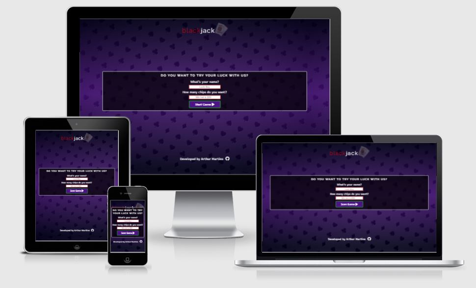
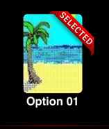

# blackjack

blackjack is a website for those who want, in their spare time, to practice and have fun playing a good blackjack game. The site target those who like card games and want to have a good time playing without the risk to lose real money.

https://arthurmezaonik.github.io/portfolio_project_02/

## Author

Arthur Henrique EL Mezaonik Martins

## Table of Contents

## Design Choices

### Typography

* Raleway - Raleway font was used for the logo and subtitle.

[Raleway Font](assets/images/readme/ralewayfont.PNG)

* Recursive - Recursive font was used as the main font.

[Recursive Font](assets/images/readme/recursivefont.PNG)

### Colors

[Color pallet](assets/images/readme/colors.png)

* The colors #FF0000 and #000000 were chosen based on a real color deck.

* The color #FFFFFF is used for text when there is a black background.

* The colors #268E35 and #005B00 were chosen based on the color of card games table.

* The color #6015A6 was chose to give a good contrast with the other colors.

### Images

* The logo image was chosen to represent card games.

* The background card images were chosen thinking on the game solitaire from Windows 98.

* The background table images were chosen to represent different card table layouts. 

### Wireframes

* Home Page

    * [Desktop](assets/images/readme/desktop.png)

    * [Tablet and Mobile](assets/images/readme/tabletmobile.png)

## Features

### Implemented Features

#### Header

[Header](assets/images/readme/header.PNG)

* A basic header that displays the logo. Fit for all devices.

#### Game Table

[Game table](assets/images/readme/gametable.PNG)

* The game table display the dealer and player cards and points.

* For the player, display the options HIT and STAND as well.

* At the bottom of the table, it's displayed the points.

#### Page Buttons

[Page buttons](assets/images/readme/pagebuttons.PNG)

* The first button opens the settings.

* The second button displays the instruction container.

* The third button reload the page.

#### Settings buttons

[Settings buttons](assets/images/readme/settingsbuttons.PNG)

* The first button pause and play the background music.

* The second button pause and play the win and lose audios.

* The third button displays the card background options.

* The fourth button displays the table background options.

#### Instructions

[Instructions](assets/images/readme/instructioncontainer.PNG)

* Displays the game instructions.

#### Background Cards

[Background Card](assets/images/readme/backgroundcard-container.PNG)

* Displays different images that can be used as background for the cards.

#### Background Table

[Background Table](assets/images/readme/backgroundtable-container.PNG)

* Displays different images that can be used as background for the table.

#### Footer

[Footer](assets/images/readme/footer.PNG)

* The footer displays the author's name and includes links to the author's Github page.

### Future Features

* For future features, we hope to implement a way for the user to choose how much he wants to bet in each turn, and base on that create a jar that shows how much "money" the player has.

* We want to implement an animation that displays the cards being shuffled.

## Testing

### Validation Testing

* CSS Validator

    * No errors found

* HTML Validator

    * [Buttons](assets/images/readme/html01.JPG)
        * Removed all __div__ and __p__ elements that were button childs.

    * [Tag problems](assets/images/readme/html02.JPG)
        * Solved all problens with wrong tag names and missing tags.
        * Changed aria-label position.

* JS Validator
    
    * No erros returned.

    * Five warnings that still unsolved.

        * [Warnings](assets/images/readme/warnings.)

### Lighthouse Test

* All approved

### Cross Browser and Cross Device Testing

|  TOOL / Device |  BROWSER |  OS | SCREEN WIDTH  |
|---|---|---|---|
| real phone: iPhone 6  | safari  | iOS  |  375 x 667  |
| real phone: iPhone 8 Plus  | safari  | iOs  |  414 x 736 |
| real tablet: iPad  |  safari |  iOs | 768 x 1024  |
|  dev tools: Moto G4 | chrome  | android  | 360 x 640  |
|  dev tools: iPad Pro |  chrome |  iOs |  1024 x 1366 |
|  dev tools: Galaxy S5 | chrome  |  android | 360 x 640  |
|  real computer: Dell Ispiron | chrome  | Windows 10  | 1920 x 1080  |

### Manual Testing

| Feature Tested                          | Steps Taken                                                                                                                                                                                                                         |
|-----------------------------------------|-------------------------------------------------------------------------------------------------------------------------------------------------------------------------------------------------------------------------------------|
| First message form                 | 1. Tried to submit with name input empty 2. Verify if return error 3. Tried to submit with the chips input 4. Verify if return error  5. Tried to submit with a value < 50 6. Verify if return error 7. Tried to submit with valid valuest 8. Verify if return error                                |
| Hit Button                         | 1. Verify if after click player receive another card |
| Stand Button                       | 1. Verify if after click start dealer round   |
| Messages                           | 1. Played several times and check if return the right message   |
| Yes Button                         | 1. Check if the game restart   |
| No Button                          | 1. Check if the game end |
| Points                             | 1. Played several times and check if the points accumulated correctly  |
| Setting Button                     | 1. Check if display the settings menu  |
| Instruction Button                 | 1. Check if display the instructions  |
| Restart Button                     | 1. Check if the page reload  |
| Play/Pause Music Button            | 1. Check if the music play and pause after click  |
| Play/Pause Audio Button            | 1. Check if the audio play and pause after click  |
| Card Background Button             | 1. Check if open container with card background images options  |
| Table Background Button            | 1. Check if open container with table background images options |
| Card Background Option             | 1. Tried all the otpions and check if change the cards background |
| Table Background Option            | 1. Tried all the otpions and check if change the table background |

### Unfixed Bugs

* Button icon no centrilized (detected in Safari browser)

    * 

* Card and table ribbon position (detected in Safari browser)

    * 

## Deployment

### Deploy to GitHub Pages

* The site was deployed to GitHub pages. The steps to deploy are as follows:
	
* In the GitHub repository, navigate to the Settings tab

* From the source section drop-down menu, select the Master Branch

* Once the master branch has been selected, the page will be automatically refreshed with a detailed ribbon display to indicate the successful deployment.

## Credits

### Content

### Media

1. Game Page

    * Logo image: https://www.casinogamblingstrategy.org/blackjack/

    * Background image: https://pt.vecteezy.com/arte-vetorial/2082545-casino-fundo-abstrato-moderno-com-cartas-sinais-poquer-simbolos-no-fundo-preto-cassino-simbolos-vetor-widescreen-wallpaper

    * Cards background image: https://blog.imaginarium.com.br/imaginarium/jogos-do-windows-computador-nos-anos-90/

    * Table background 1: https://photostockeditor.com/clip-art-vector/poker-table-felt

    * Table background 2: https://br.freepik.com/vetores-premium/fundo-de-mesa-de-poquer-na-cor-verde_7170525.htm

    * Table background 3: https://br.freepik.com/vetores-premium/fundo-de-mesa-de-poquer-na-cor-verde_7773320.htm

    * Table background 4: https://br.depositphotos.com/vector-images/trevo-de-poker.html

2. Icons

    * All icons: https://fontawesome.com/

3. Music and Sounds

    * Background music: https://www.melodyloops.com/

    * Sounds (Youtube channel): https://www.youtube.com/channel/UC-Gn4r2cjTR12J9cnJ8DtdA

### Acknowledgments

* Code Institute: Love Maths Project

* Layout idea: https://myaccount.partypoker.com/en/labelhost/login

* CSS Reset: https://meyerweb.com/eric/tools/css/reset/

* Colors Pallet: https://coolors.co/

* Ribbon Generator (awards page): https://www.cssportal.com/css-ribbon-generator/

* Background gradient: https://cssgradient.io/

* Reload page with javascript: https://www.horadecodar.com.br/2021/04/02/como-recarregar-a-pagina-com-javascript-refresh/

* Change image src with javascript: https://qastack.com.br/programming/11722400/programmatically-change-the-src-of-an-img-tag

* Shuffle function: https://flaviocopes.com/how-to-shuffle-array-javascript/

* Tables Generator (readme): https://www.tablesgenerator.com/markdown_tables

* Table of contents generator (readme): https://ecotrust-canada.github.io/markdown-toc/

* Malia Havlicek: Reviewing and giving suggestions how to improve my project.
	
{"mode":"full","isActive":false}